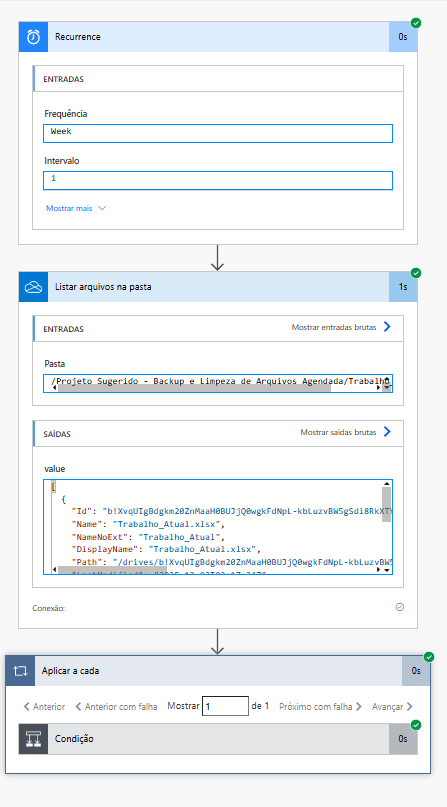

# 🗄️ Automação de Backup e Limpeza de Arquivos

Projeto de rotina de TI desenvolvido para otimização de armazenamento em nuvem. O sistema identifica arquivos inativos (sem modificação recente) e os move automaticamente para um diretório de arquivamento, mantendo a pasta de trabalho organizada e em conformidade.

## 📷 Visão Geral do Fluxo Lógico

<div align="center">
  
  <br>
  <em>O robô verifica a data de modificação de cada arquivo e decide se deve arquivá-lo.</em>
</div>

---

## 🛠 Tecnologias Utilizadas
* **Power Automate:** Orquestração do fluxo agendado e loops de verificação.
* **OneDrive for Business:** Manipulação de sistema de arquivos em nuvem.
* **Expressões WDL (Workflow Definition Language):** Uso de funções avançadas como `addDays()` e `utcNow()` para cálculo temporal.

## ⚙️ Arquitetura da Solução
1.  **Gatilho (Trigger):** Agendamento semanal (*Recurrence*) para execução automática fora do horário comercial.
2.  **Leitura:** O fluxo lista todos os metadados dos arquivos presentes na pasta de trabalho principal.
3.  **Decisão Lógica:** Verifica individualmente se a "Hora da última modificação" é anterior a 30 dias atrás.
4.  **Ação:** Move os arquivos que atendem ao critério para a pasta de "Arquivo Morto" (Backup).

---

## 🏗️ Como foi construído (Passo a Passo)

O desenvolvimento focou na lógica condicional de datas para garantir que apenas arquivos obsoletos fossem movidos.

### 1. Estrutura de Diretórios
* Implementação de taxonomia no **OneDrive**:
    * 📂 `Trabalho_Atual`: Pasta "Hot" onde os arquivos são criados e editados diariamente.
    * 📂 `Arquivado_Antigo`: Pasta "Cold" para armazenamento de longo prazo.

### 2. Configuração do Fluxo
* **Listagem:** Utilização da ação *List files in folder* para obter os IDs e datas de todos os itens.
* **Iteração:** Aplicação de um laço *Apply to each* para processar a lista item por item.

### 3. A Lógica de "30 Dias"
* Criação de uma condição comparando a propriedade dinâmica `LastModified` com a expressão:
    ```excel
    addDays(utcNow(), -30)
    ```
    *(Esta função calcula a data exata de 30 dias atrás no momento da execução. Se a data do arquivo for menor que isso, ele é considerado antigo).*

### 4. Movimentação Segura
* Configuração da ação *Move file* utilizando o **ID único** do arquivo (em vez do nome) para evitar erros de referência durante a transferência.

---

## 🚀 Impacto do Projeto
* **Organização Automática:** Mantém a pasta de trabalho limpa sem intervenção humana.
* **Segurança de Dados:** Garante que documentos antigos não sejam deletados, mas sim preservados em local apropriado.
* **Eficiência:** Elimina o tempo gasto por colaboradores organizando pastas manualmente.
